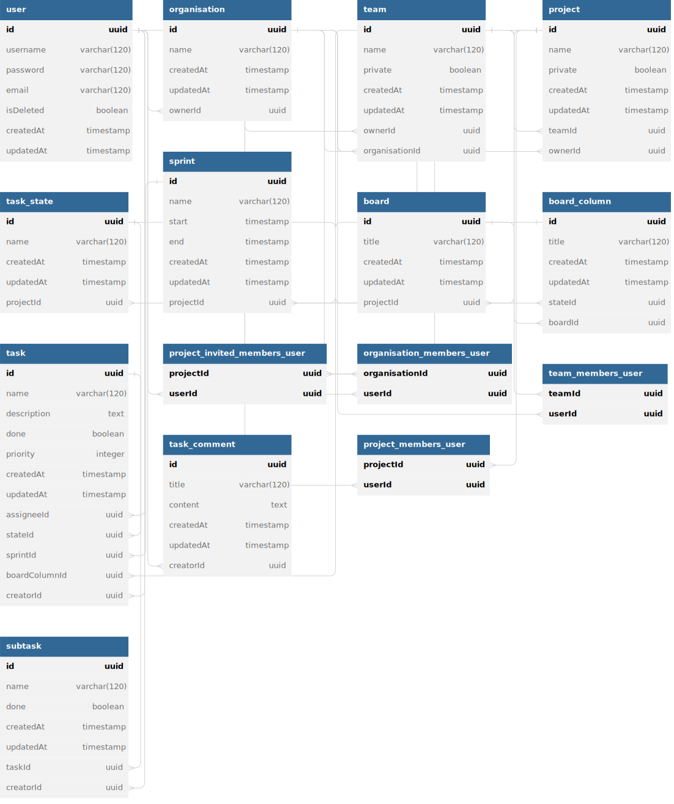

# Project Management Backend



## Installation

```bash
$ npm install
```

## Running the app

```bash
# development
$ ./start.sh

# production
$ docker compose up

# push image to docker hub
$ ./publish.sh
```
